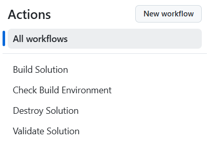
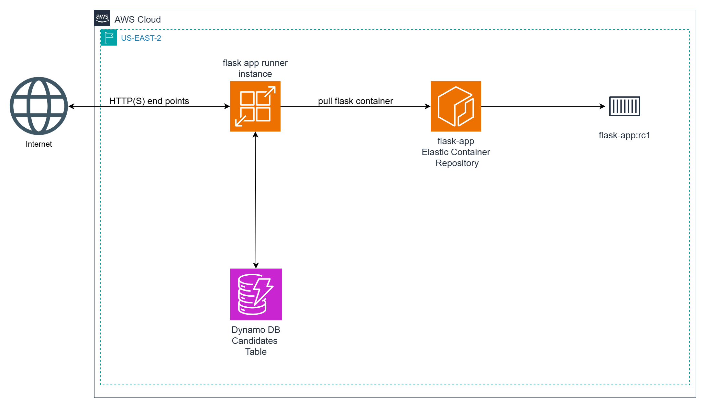
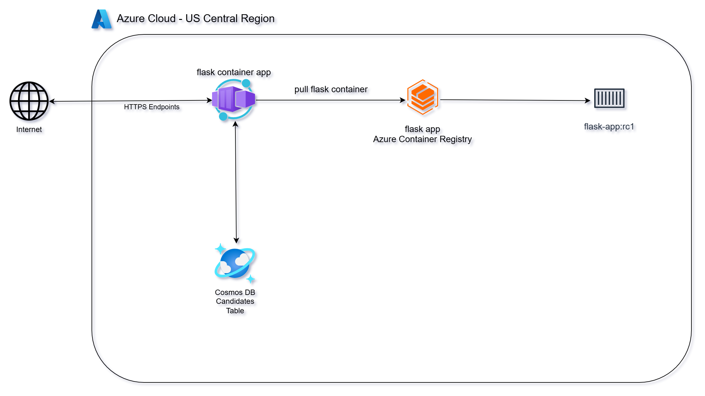
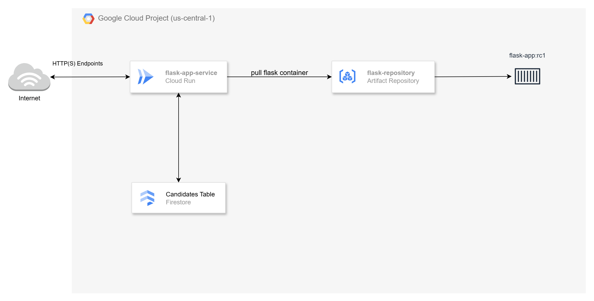

# Containerizing Microservices Across AWS, Azure, and GCP

**This video series complements the [Scaling in the Cloud](https://github.com/mamonaco1973/cloud-scaling-intro/blob/main/README.md) series**, where we deployed a simple Python-based microservice using the Flask framework across different cloud platforms.

In this new series, we'll take that same microservice and containerize it using **Docker**. You'll learn how to:

- **Use a document database** for microservice data storage:
   - **DynamoDB** for AWS
   - **CosmosDB** for Azure
   - **Firestore** for GCP
- **Build a Docker container** for the microservice, optimizing it for cloud deployments.
- **Push the container image** to the appropriate container registry for each cloud provider:
  - **Amazon ECR (Elastic Container Registry)** for **AWS**  
  - **Azure Container Registry (ACR)** for **Azure**  
  - **Google Artifact Registry (GAR)** for **GCP**  
- **Deploy the container** using the simplest container runtime services offered by each cloud provider:
  - **AWS App Runner** for fully managed container deployments on AWS  
  - **Azure Container Apps** for serverless container hosting on Azure  
  - **Google Cloud Run** for scalable, stateless container execution on GCP  

## What You'll Learn

By the end of this series, you’ll have hands-on experience with:  
- Building Docker containers from scratch  
- Pushing container images to cloud registries  
- Deploying containerized applications with minimal configuration  
- Understanding the key differences between App Runner, Container Apps, and Cloud Run  

This series is designed to help you get comfortable with simple container deployment workflows in **AWS**, **Azure**, and **GCP** before moving on to the complexities of `Kubernetes`.

There is a followup series to this series called [Configuring GitHub Actions in AWS, Azure and GCP](./.github/workflows/README.md). In that series we build these projects within the GitHub ecosystem using GitHub Actions.

## Quick Links

1. [Simple Cloud Containers: Docker Containers in AWS, Azure, and GCP](https://youtu.be/2BQB-OMAhH8)
2. AWS Solution
   - [Simple AWS Containers](https://youtu.be/hhtDigvwMwk)
   - [GitHub Project](https://github.com/mamonaco1973/aws-flask-container/)
3. Azure Solution
   - [Simple Azure Containers](https://youtu.be/eogMQjbBvTo)
   - [GitHub Project](https://github.com/mamonaco1973/azure-flask-container/)
4. GCP Solution
   - [Simple GCP Containers](https://youtu.be/9q0hXgSssPI)
   - [GitHub Project](https://github.com/mamonaco1973/gcp-flask-container/)

## Comparing Container Registry Solutions

When deploying containerized applications to the cloud, storing and managing your container images securely and efficiently is critical. Each major cloud provider offers its own **Container Registry** solution, with some key differences and similarities:

### **Amazon Elastic Container Registry (ECR)**
- **Integration:** Deeply integrated with AWS services like ECS, EKS, and App Runner.
- **Authentication:** Uses AWS IAM for secure access control.
- **Performance:** Optimized for use within AWS, offering fast image pulls in the same region.
- **Features:**
  - Supports private and public repositories.
  - Image vulnerability scanning with Amazon Inspector.
  - Lifecycle policies to manage image retention.
- **Pricing:** Based on data storage and image transfer (free transfers within the same region).

### **Azure Container Registry (ACR)**
- **Integration:** Works seamlessly with Azure services like AKS, Azure Container Apps, and Azure Functions.
- **Authentication:** Supports Azure Active Directory (AAD) for role-based access control.
- **Performance:** Offers geo-replication to sync registries across regions for faster access.
- **Features:**
  - Build and task automation directly within ACR.
  - Content Trust for image signing and verification.
  - Support for Helm charts and OCI artifacts.
- **Pricing:** Based on service tier (Basic, Standard, Premium) and storage/transfer usage.

### **Google Artifact Registry (GAR)**
- **Integration:** Natively integrated with Google Cloud services like GKE, Cloud Run, and Cloud Build.
- **Authentication:** Uses Google Cloud IAM for fine-grained access control.
- **Performance:** Global availability with multi-region storage options for faster image pulls.
- **Features:**
  - Native support for Docker and OCI-compliant images.
  - Vulnerability scanning via Google Artifact Analysis.
  - Flexible repository configurations for regional, multi-regional, and hybrid cloud deployments.
- **Pricing:** Based on storage and network egress; free within the same region.

---

### **Key Differences at a Glance**

| **Feature**               | **AWS ECR**                  | **Azure ACR**                    | **Google Artifact Registry (GAR)**   |
|---------------------------|------------------------------|----------------------------------|--------------------------------------|
| **Auth Mechanism**        | IAM Roles & Policies         | Azure AD (RBAC)                  | Google IAM                           |
| **Vulnerability Scanning**| Yes (Amazon Inspector)       | Yes (Built-in)                   | Yes (Artifact Analysis)              |
| **Geo-Replication**       | No                           | Yes (Premium Tier)               | Multi-region support                 |
| **Build Automation**      | Limited                      | Integrated Build Tasks           | Cloud Build Integration              |
| **Pricing Model**         | Storage & Transfer           | Tier-based + Usage               | Storage & Egress                     |

---

## Comparing Simplified Container Runtimes

Modern cloud platforms offer **simplified container runtimes** that abstract away much of the complexity involved in container orchestration. Let’s compare **AWS App Runner**, **Azure Container Apps**, and **Google Cloud Run** to understand their strengths and trade-offs.

### **AWS App Runner**
- **Use Case:** Best for deploying web applications and APIs without managing infrastructure.
- **Deployment:** Direct from ECR or GitHub repositories.
- **Scaling:** Auto-scales based on incoming requests; supports both manual and automatic scaling.
- **Networking:** Supports private connectivity with VPC integration.
- **Features:**
  - SSL/TLS enabled by default.
  - Built-in load balancing and health checks.
  - IAM roles for secure resource access.

**Pros:**
- Extremely easy to set up with minimal configuration.
- Strong AWS ecosystem integration.

**Cons:**
- Limited flexibility for complex networking scenarios.
- Slightly higher cost compared to Fargate for large workloads.

---

### **Azure Container Apps**
- **Use Case:** Ideal for microservices, event-driven applications, and background processing.
- **Deployment:** Supports containers from ACR, Docker Hub, or any OCI-compliant registry.
- **Scaling:** Powered by **KEDA**, allowing scaling based on events (HTTP, queue messages, etc.).
- **Networking:** Supports both public and private endpoints with VNET integration.
- **Features:**
  - Built-in Dapr support for microservice development.
  - Ingress traffic splitting for A/B testing.
  - Managed secrets for environment variables.

**Pros:**
- Event-driven scaling capabilities are powerful.
- Great for microservices with complex scaling needs.

**Cons:**
- Learning curve for KEDA-based scaling triggers.
- Performance overhead for very lightweight applications compared to Azure Functions.

---

### **Google Cloud Run**
- **Use Case:** Best for stateless HTTP containers and APIs, designed for rapid scaling.
- **Deployment:** Supports deploying from Artifact Registry or local Docker builds.
- **Scaling:** Scales to zero when idle and up to thousands of instances instantly during peak demand.
- **Networking:** Supports both public and private services (VPC connectors available).
- **Features:**
  - Integrated with Cloud Build and Cloud Scheduler.
  - Granular IAM controls for service-level access.
  - Request-based billing (pay only for the actual usage).

**Pros:**
- Blazing fast scaling with per-request billing.
- Simplified deployment workflow with CI/CD tools.

**Cons:**
- Cold start latency can affect real-time applications.
- Limited control over the underlying infrastructure.

---

### **Key Differences at a Glance**

| **Feature**               | **AWS App Runner**               | **Azure Container Apps**              | **Google Cloud Run**                  |
|---------------------------|----------------------------------|---------------------------------------|--------------------------------------|
| **Scaling Mechanism**     | Request-based auto-scaling       | Event-driven (KEDA) + HTTP scaling    | Request-based, scales to zero        |
| **VPC Integration**       | Yes (VPC support)                | Yes (VNET support)                    | Yes (VPC connectors)                 |
| **Deployment Sources**    | ECR, GitHub                      | ACR, Docker Hub, Custom Registries    | Artifact Registry, Local Builds      |
| **Pricing Model**         | Per-container-hour + data transfer | Per-container-hour + executions      | Request-based (per 100ms) + invocations |
| **Cold Start Latency**    | Low                              | Moderate (depends on scaling triggers) | Possible (can be mitigated with min instances) |

---

## Service Endpoint Summary

- [AWS Source Code](https://github.com/mamonaco1973/aws-flask-container/blob/main/02-docker/app.py)
- [Azure Source Code](https://github.com/mamonaco1973/azure-flask-container/blob/main/02-docker/app.py)
- [GCP Source Code](https://github.com/mamonaco1973/gcp-flask-container/blob/main/02-docker/app.py)

### `/gtg` (GET)
- **Purpose**: Health check.
- **Response**: 
  - `{"connected": "true", "instance-id": <instance_id>}` (if `details` query parameter is provided).
  - 200 OK with no body otherwise.

### `/candidate/<name>` (GET)
- **Purpose**: Retrieve a candidate by name.
- **Response**: 
  - Candidate details (JSON) with status `200`.
  - `"Not Found"` with status `404` if no candidate is found.

### `/candidate/<name>` (POST)
- **Purpose**: Add or update a candidate by name.
- **Response**: 
  - `{"CandidateName": <name>}` with status `200`.
  - `"Unable to update"` with status `500` on failure.

### `/candidates` (GET)
- **Purpose**: Retrieve all candidates.
- **Response**: 
  - List of candidates (JSON) with status `200`.
  - `"Not Found"` with status `404` if no candidates exist.
